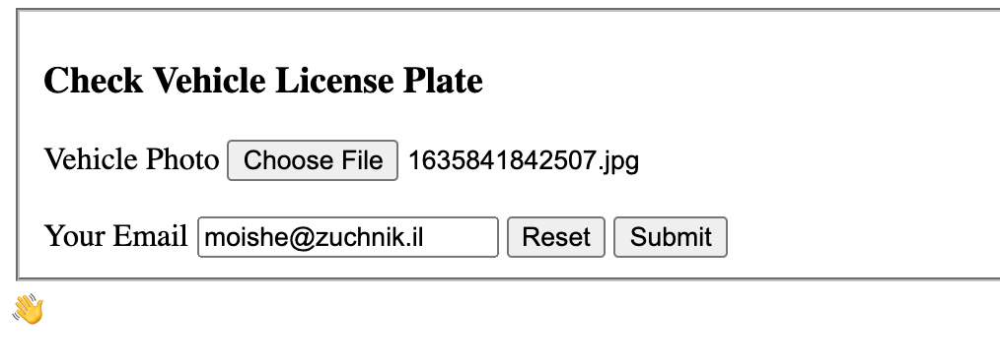

# vehicle-checker GCP Workflows Demo

The solution is composed of these services:

* Gateway Service (Written in NodeJS, Deployed in Cloud Run)
* License Plate Service (Written in Python, Deployed in Cloud Run)
* Notification Service (Written in Golang, Deployed in Cloud Run)
* The workflow (Deployed in GCP Workflows)

## Gateway Service
Provides a static webpage and a simple backend for it. This is the flow entry-point.

The user uploads a photo of a vehicle, alongside providing the user email-address:

The gateway backend saves the vehicle image to GCS (Google Cloud Storage), and initiates a GCP workflow execution.

## License Plate Service
The License Plate service reads the vehicle image (which was saved previously by the Gateway service), and sends the image to Google Cloud Vision API. 
Google Cloud Vision API will try and track objects in the image. In our case, we are interested in a Vehicle License Plate object.

If we found such an object, the License Plate service will crop the image to contain only the license plate.

Then, it will look for a yellow box (which represents an Israeli license plate) and it will re-crop around it.
(Why? In Israel a license plate can containt arbitrary text at the bottom, and it can be anything that your car garage choose to put there)

Then, we are left with a yellow box with black numbers - which is the license plate number.

The License Plate service will now call the Google Cloud Vision API once again, but now to extract text from the image.

And now, we have the license plate number!

## Notification Service
The Notification service gets a bunch of vehicle details and just sends it as an email using SendGrid. It's a pretty boring service actually.

## The workflow
This is the orchestrator that "connects" all of these services together. TBD

# Flow Diagram
